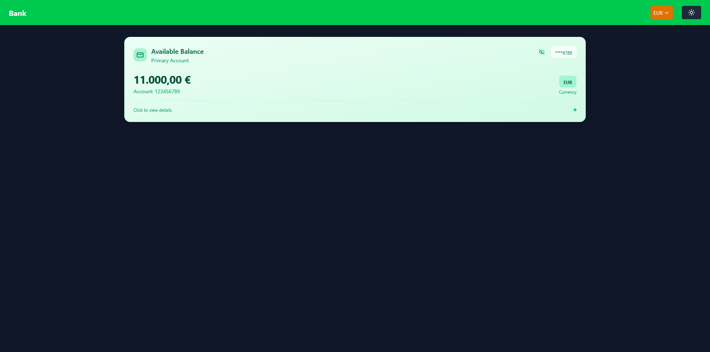
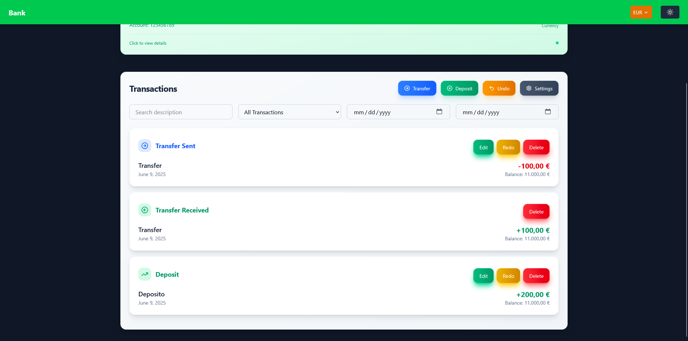
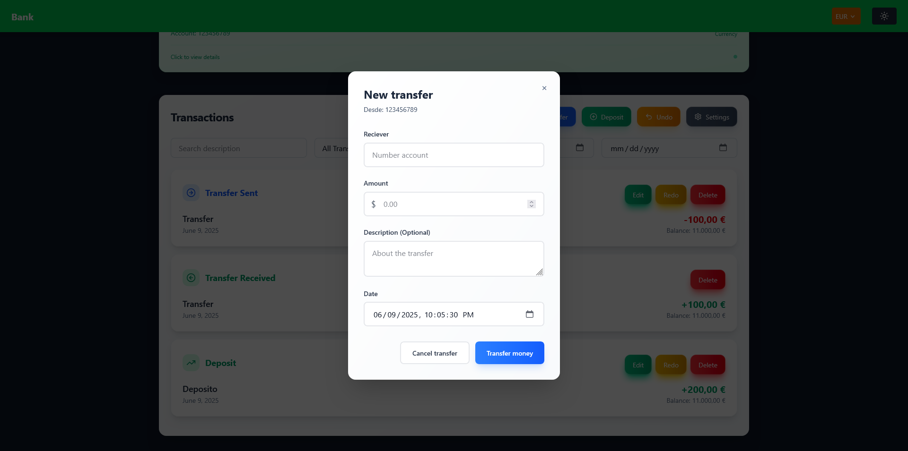
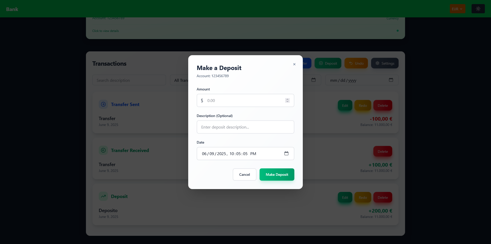
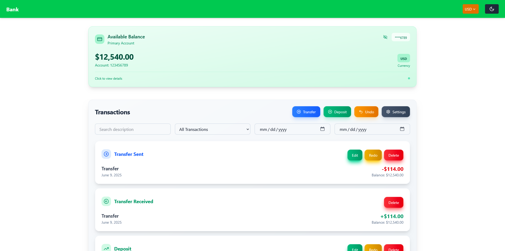
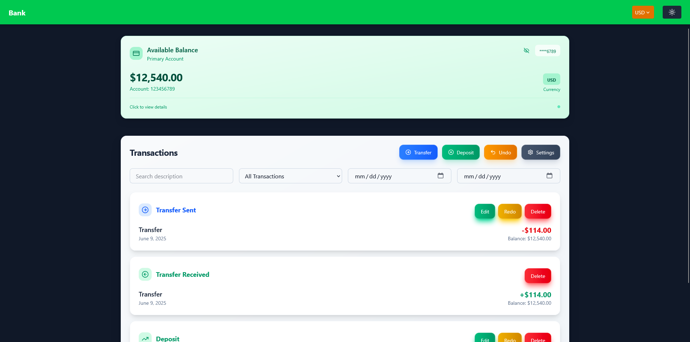
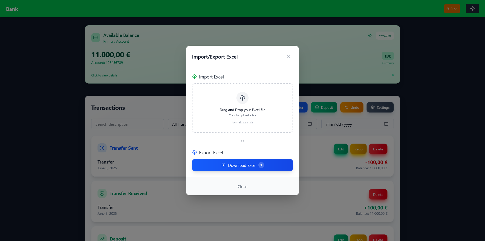

# 💰 Bank App

A professional banking interface built with **React** and **TypeScript**, designed to simulate core banking functionalities such as real-time balance tracking, transaction history management, currency formatting, and undo/redo capabilities. The application includes support for dark mode and Excel import/export for data portability.

---

## 🚀 Features

- 📊 Real-time account balance display
- 🧾 Transaction history (deposits, transfers, redos, undos)
- ➕ Add, edit, and redo deposits or transfers
- ↩️ Undo and redo transaction history with full state recovery
- 💡 Light and Dark mode toggle
- 💱 Multi-currency formatting
- 📥📤 Import/export Excel (.xls/.xlsx) files
- 💾 Local persistence using IndexedDB
- ✅ Fully typed with TypeScript for maintainability and scalability

---

## 🧰 Technologies Used

- **React + TypeScript** – Frontend UI and logic
- **React Hooks** – State and side-effect management
- **Vite** – Lightning-fast build tool and dev server
- **CSS Modules / Styled Components** *(Specify which one you use)*
- **IndexedDB** – Persistent client-side storage
- **xlsx** – Excel file parsing and generation

---

## 🧱 Project Structure & Architecture

### 🔧 Core Components

| File/Component             | Description |
|---------------------------|-------------|
| `App.tsx`                 | Main application component and router |
| `accountBalance.tsx`      | Displays the user’s current account balance |
| `accountMovement.tsx`     | Shows the account’s transaction history and handles logic |
| `Header.tsx`              | Contains the app title and access to settings |
| `ImportExportExcel.tsx`   | Modal component for importing and exporting .xls/.xlsx files. (Additional: Supports exporting filtered data, e.g., export transactions sorted by description.)
| `transferMoney.tsx`       | Modal for managing money transfers (add/edit/redo) |
| `depositMoney.tsx`        | Modal for deposits (add/edit/redo) |
| `types.ts`                | Type definitions and interfaces |

---

### ⚙️ Utility Functions & Settings

| File/Component            | Description |
|--------------------------|-------------|
| `ChangeCurrency.tsx`     | Modal to switch app-wide currency format |
| `DarkMode.tsx`           | Toggle button for Light/Dark themes |
| `formatted.tsx`          | Utility for currency and date formatting |
| `UndoReansaction.tsx`    | Modal for undoing previous transactions |

---

### 🗃️ IndexedDB Integration

| File                     | Description |
|-------------------------|-------------|
| `basics.ts`             | CRUD operations for IndexedDB to persist user data |

---

## 📸 Screenshots

### 💼 Dashboard – Account Overview


### 🔁 TransactionView Feature


### 🔁 Transaction Feature


### ➕ Add Deposit Modal


### 🌙 Dark Mode View


### 🔁 Currency Feature


### 🔁 Excel Feature



### Prerequisites

- Node.js (18+ recommended)
- npm or yarn

### Installation

```bash
git clone https://github.com/W3LLSSS/bank.git
cd bank
npm install
npm run dev
